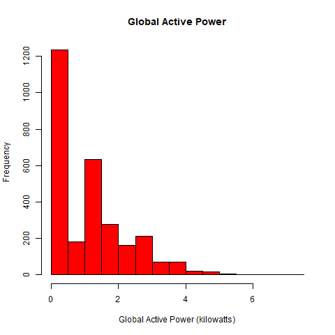
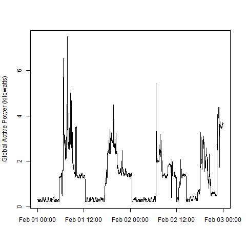
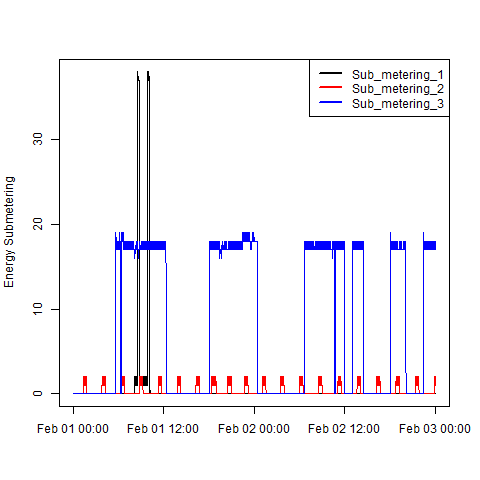
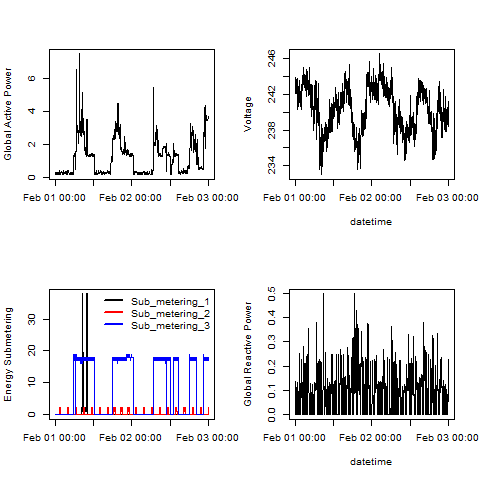

# CourseraExploratoryDataAnalysisJohnsHopkinsUniversityPeer-AssignmentCourseProject1
Coursera Exploratory Data Analysis Johns Hopkins University Peer-Assignment Course Project 1
# Exploratory Data Analysis: Household Electric Power Consumption

## Assignment Overview
This project analyzes household energy usage data from the **UC Irvine Machine Learning Repository**. The goal is to reconstruct four exploratory plots using base R plotting to understand power consumption patterns between February 1-2, 2007.

---

## Dataset
**Dataset Name**: [Individual household electric power consumption Data Set](https://archive.ics.uci.edu/ml/datasets/individual+household+electric+power+consumption)  
**Size**: 20 MB  
**Description**: Measurements of electric power consumption in one household with one-minute sampling over ~4 years.  

### Variables
The dataset contains 9 variables:  
1. **Date**: Date in `dd/mm/yyyy` format.  
2. **Time**: Time in `hh:mm:ss` format.  
3. **Global_active_power**: Household global minute-averaged active power (kW).  
4. **Global_reactive_power**: Household global minute-averaged reactive power (kW).  
5. **Voltage**: Minute-averaged voltage (V).  
6. **Global_intensity**: Household global minute-averaged current intensity (A).  
7. **Sub_metering_1**: Kitchen (watt-hour of active energy).  
8. **Sub_metering_2**: Laundry room (watt-hour of active energy).  
9. **Sub_metering_3**: Electric water-heater & air-conditioner (watt-hour of active energy).  

---

## Repository Structure
ExData_Plotting1/
├── plot1.R # Code for Plot 1
├── plot1.png # Global Active Power Histogram
├── plot2.R # Code for Plot 2
├── plot2.png # Global Active Power Time Series
├── plot3.R # Code for Plot 3
├── plot3.png # Energy Sub-metering
├── plot4.R # Code for Plot 4
├── plot4.png # Multi-panel Analysis
└── README.md # Project Documentation

Copy

---

## Plots

### Plot 1: Global Active Power Histogram  
  
**Description**: Distribution of household global active power consumption.  

---

### Plot 2: Global Active Power Over Time  
  
**Description**: Time series of global active power (kW) during February 1-2, 2007.  

---

### Plot 3: Energy Sub-metering Comparison  
  
**Description**: Sub-metering trends for kitchen, laundry, and HVAC systems.  

---

### Plot 4: Multi-panel Analysis  
  
**Description**: Combined plots for active power, voltage, sub-metering, and reactive power.  

---